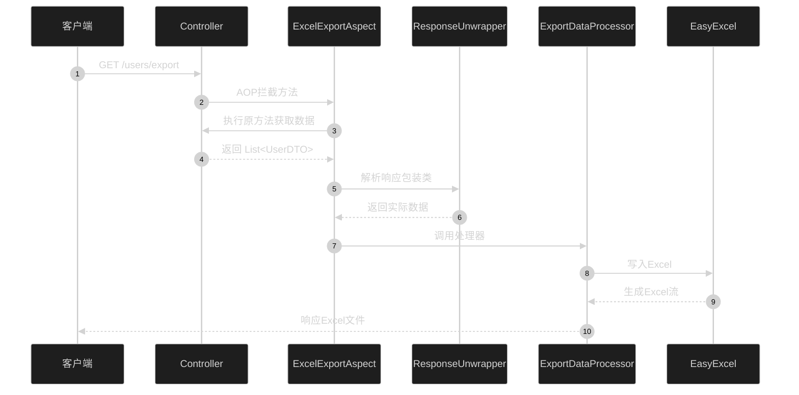
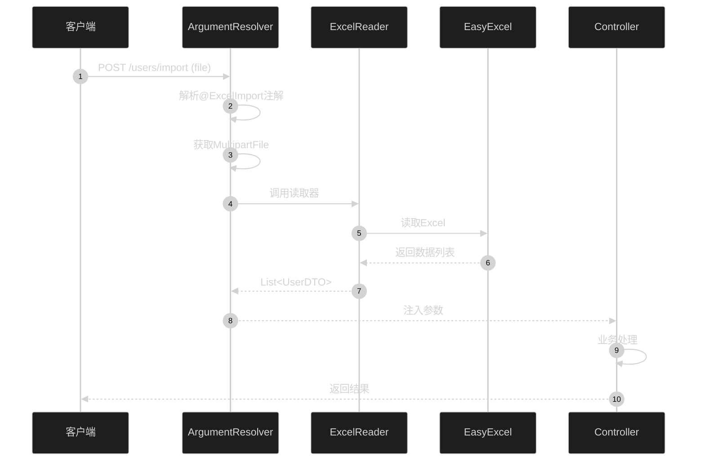
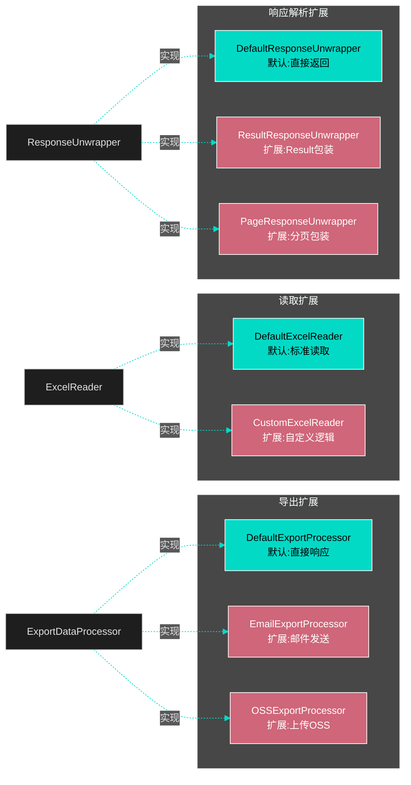

# Spring MVC Excel IO 架构设计

## 整体架构

```mermaid
%%{init: {'theme':'dark','themeVariables': {'primaryColor':'#BB86FC','primaryTextColor':'#fff','primaryBorderColor':'#BB86FC','lineColor':'#03DAC6','secondaryColor':'#03DAC6','tertiaryColor':'#3700B3','background':'#121212','mainBkg':'#1E1E1E','secondBkg':'#2D2D2D','textColor':'#E1E1E1','fontSize':'16px'}}}%%
graph TB
    subgraph "应用层 Application Layer"
        Controller[Controller<br/>@ExcelExport/@ExcelImport]
    end
    
    subgraph "切面层 Aspect Layer"
        ExportAspect[ExcelExportAspect<br/>AOP拦截]
        ArgResolver[ExcelImportArgumentResolver<br/>参数解析]
    end
    
    subgraph "处理层 Processing Layer"
        Processor[ExportDataProcessor<br/>导出处理器]
        Reader[ExcelReader<br/>读取器]
        Unwrapper[ResponseUnwrapper<br/>响应解析器]
    end
    
    subgraph "工具层 Utility Layer"
        EasyExcel[EasyExcel<br/>Excel操作库]
        Utils[ExcelUtils<br/>工具类]
    end
    
    Controller -->|标注注解| ExportAspect
    Controller -->|参数解析| ArgResolver
    ExportAspect -->|获取数据| Unwrapper
    ExportAspect -->|调用处理| Processor
    ArgResolver -->|读取Excel| Reader
    Processor -->|写入Excel| EasyExcel
    Reader -->|读取Excel| EasyExcel
    Utils -->|封装操作| EasyExcel
    
    style Controller fill:#BB86FC,stroke:#fff,color:#000
    style ExportAspect fill:#03DAC6,stroke:#fff,color:#000
    style ArgResolver fill:#03DAC6,stroke:#fff,color:#000
    style Processor fill:#CF6679,stroke:#fff,color:#fff
    style Reader fill:#CF6679,stroke:#fff,color:#fff
    style Unwrapper fill:#CF6679,stroke:#fff,color:#fff
    style EasyExcel fill:#3700B3,stroke:#fff,color:#fff
    style Utils fill:#3700B3,stroke:#fff,color:#fff
```

## 导出流程



## 导入流程



## 扩展机制



## 核心设计模式

### 1. 策略模式 (Strategy Pattern)

**应用：** 导出处理器、读取器的选择

```java
// 接口定义策略
public interface ExportDataProcessor {
    void process(...);
}

// 不同策略实现
@Component
class DefaultExportProcessor implements ExportDataProcessor { }

@Component  
class EmailExportProcessor implements ExportDataProcessor { }
```

### 2. 责任链模式 (Chain of Responsibility)

**应用：** 响应解析器链

```java
// 按优先级排序
responseUnwrappers.sort(Comparator.comparingInt(ResponseUnwrapper::getOrder));

// 找到第一个支持的解析器
for (ResponseUnwrapper unwrapper : responseUnwrappers) {
    if (unwrapper.supports(result)) {
        return unwrapper.unwrap(result);
    }
}
```

### 3. 模板方法模式 (Template Method)

**应用：** Excel 操作流程

```java
// 定义操作流程
public interface ExcelReader {
    <T> List<T> read(InputStream inputStream, Class<T> dataClass);
}

// 子类实现具体步骤
```

### 4. AOP 切面 (Aspect Oriented Programming)

**应用：** 导出功能的非侵入式实现

```java
@Around("@annotation(ExcelExport)")
public Object aroundExport(ProceedingJoinPoint joinPoint) {
    // 前置处理
    Object result = joinPoint.proceed();
    // 后置处理：导出Excel
}
```

### 5. 自定义参数解析器

**应用：** 导入功能的优雅实现

```java
public class ExcelImportArgumentResolver implements HandlerMethodArgumentResolver {
    boolean supportsParameter(MethodParameter parameter);
    Object resolveArgument(...);
}
```

## 项目结构

```
src/main/java/com/chatlabs/cdev/
├── annotation/              # 注解定义
│   ├── ExcelExport.java    # 导出注解
│   └── ExcelImport.java    # 导入注解
├── aspect/                  # AOP切面
│   └── ExcelExportAspect.java
├── config/                  # 自动配置
│   ├── ExcelIOAutoConfiguration.java
│   └── ExcelIOProperties.java
├── processor/               # 数据处理器
│   ├── ExportDataProcessor.java
│   └── DefaultExportProcessor.java
├── resolver/                # 参数解析器
│   └── ExcelImportArgumentResolver.java
├── reader/                  # Excel读取器
│   ├── ExcelReader.java
│   └── DefaultExcelReader.java
├── unwrapper/               # 响应解析器
│   ├── ResponseUnwrapper.java
│   └── DefaultResponseUnwrapper.java
├── exception/               # 异常定义
│   └── ExcelIOException.java
├── util/                    # 工具类
│   └── ExcelUtils.java
└── example/                 # 示例代码
    ├── controller/
    └── dto/
```

## 技术特点

### 1. 声明式编程
通过注解即可实现功能，无需编写样板代码

### 2. 高度解耦
各模块职责清晰，易于测试和维护

### 3. 灵活扩展
基于接口编程，支持自定义实现

### 4. Spring Boot 集成
自动配置，开箱即用

### 5. 最小依赖
仅依赖 Spring Boot 和 EasyExcel

## 性能考虑

1. **流式处理**：EasyExcel 支持大文件流式读写
2. **内存优化**：避免一次性加载所有数据
3. **异步处理**：可扩展异步导出功能
4. **缓存机制**：可缓存处理器实例

## 安全考虑

1. **文件大小限制**：通过配置限制上传文件大小
2. **文件类型验证**：验证上传文件是否为 Excel
3. **数据校验**：支持自定义校验逻辑
4. **异常处理**：统一异常处理机制

