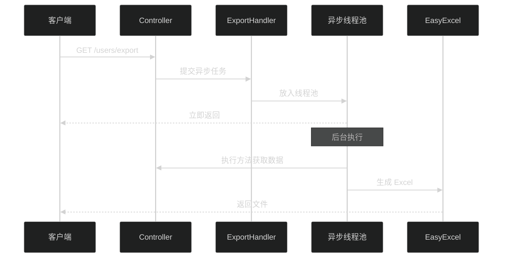

# 新功能说明

## 版本 1.1.0 新增功能

### 1. 独立的导出路径 🎯

现在支持为导出功能配置独立的路径，不再需要单独创建导出接口！

#### 默认行为

如果不指定导出路径，系统会自动在原路径后添加 `/export`：

```java
@GetMapping("/users")
@ExcelExport(dataClass = UserDTO.class)
public List<UserDTO> listUsers() {
    return userService.list();
}
```

**效果：**
- 访问 `GET /users` → 返回 JSON 数据
- 访问 `GET /users/export` → 导出 Excel 文件（自动生成）

#### 自定义导出路径

通过 `value` 属性指定自定义路径：

```java
@GetMapping("/users/list")
@ExcelExport(
    value = "/users/download",  // 自定义导出路径
    fileName = "用户数据",
    dataClass = UserDTO.class
)
public List<UserDTO> listUsers() {
    return userService.list();
}
```

**效果：**
- 访问 `GET /users/list` → 返回 JSON 数据
- 访问 `GET /users/download` → 导出 Excel 文件

#### 支持路径变量

导出路径也支持路径变量：

```java
@GetMapping("/users/{id}/orders")
@ExcelExport(
    value = "/users/{id}/orders/export",
    dataClass = OrderDTO.class
)
public List<OrderDTO> getUserOrders(@PathVariable Long id) {
    return orderService.findByUserId(id);
}
```

**效果：**
- 访问 `GET /users/1/orders` → 返回 JSON
- 访问 `GET /users/1/orders/export` → 导出该用户的订单

---

### 2. 异步导出支持 ⚡

对于大数据量导出，现在支持异步处理，避免阻塞主线程！

#### 启用异步导出

只需设置 `async = true`：

```java
@GetMapping("/users")
@ExcelExport(
    fileName = "用户列表",
    dataClass = UserDTO.class,
    async = true  // 启用异步
)
public List<UserDTO> listUsers() {
    return userService.list();
}
```

#### 异步线程池配置

在 `application.yml` 中配置：

```yaml
chatlabs:
  excel:
    io:
      # 异步导出核心线程数
      async-core-pool-size: 2
      
      # 异步导出最大线程数
      async-max-pool-size: 5
      
      # 异步导出队列容量
      async-queue-capacity: 100
```

#### 异步导出流程



#### 异步 vs 同步对比

| 特性 | 同步导出 | 异步导出 |
|------|---------|---------|
| 响应时间 | 等待导出完成 | 立即返回 |
| 适用场景 | 小数据量（< 1万条） | 大数据量（> 1万条） |
| 资源占用 | 占用请求线程 | 使用独立线程池 |
| 并发能力 | 受限于 Web 线程池 | 独立控制 |

---

### 3. 文档目录管理 📚

所有项目文档现在统一放在 `doc/` 目录下：

```
doc/
├── ARCHITECTURE.md      # 架构设计
├── OPTIMIZATION.md      # 优化记录
├── QUICKSTART.md        # 快速开始
├── REVIEW.md            # 评审报告
├── SUMMARY.md           # 项目总结
├── TESTING.md           # 测试指南
└── NEW_FEATURES.md      # 新功能说明（本文档）
```

---

## 完整示例

### 示例 1：默认导出路径

```java
@RestController
@RequestMapping("/api")
public class UserController {
    
    @GetMapping("/users")
    @ExcelExport(
        fileName = "用户列表",
        dataClass = UserDTO.class
    )
    public List<UserDTO> listUsers() {
        return userService.list();
    }
}
```

**访问方式：**
- JSON: `GET /api/users`
- Excel: `GET /api/users/export` ← 自动生成

### 示例 2：自定义导出路径

```java
@RestController
@RequestMapping("/api")
public class UserController {
    
    @GetMapping("/users/list")
    @ExcelExport(
        value = "/api/users/excel",  // 自定义路径
        fileName = "用户数据",
        dataClass = UserDTO.class
    )
    public List<UserDTO> listUsers() {
        return userService.list();
    }
}
```

**访问方式：**
- JSON: `GET /api/users/list`
- Excel: `GET /api/users/excel` ← 自定义路径

### 示例 3：异步导出大数据

```java
@RestController
@RequestMapping("/api")
public class ReportController {
    
    @GetMapping("/reports/sales")
    @ExcelExport(
        fileName = "销售报表",
        dataClass = SalesDTO.class,
        async = true  // 异步导出
    )
    public List<SalesDTO> getSalesReport() {
        // 查询大量数据
        return salesService.getAllSales();
    }
}
```

**访问方式：**
- JSON: `GET /api/reports/sales`
- Excel: `GET /api/reports/sales/export` ← 异步导出

---

## 配置说明

### 完整配置示例

```yaml
chatlabs:
  excel:
    io:
      # 基础配置
      enabled: true
      max-file-size: 10485760  # 10MB
      date-format: yyyy-MM-dd HH:mm:ss
      
      # 异步导出配置
      async-core-pool-size: 2
      async-max-pool-size: 5
      async-queue-capacity: 100
```

### 配置项说明

| 配置项 | 默认值 | 说明 |
|--------|--------|------|
| enabled | true | 是否启用 Excel IO 功能 |
| max-file-size | 10485760 | 最大文件大小（字节） |
| date-format | yyyy-MM-dd HH:mm:ss | 日期格式 |
| async-core-pool-size | 2 | 异步核心线程数 |
| async-max-pool-size | 5 | 异步最大线程数 |
| async-queue-capacity | 100 | 异步队列容量 |

---

## 迁移指南

### 从 1.0.x 升级到 1.1.0

#### 1. 更新配置前缀

**旧配置：**
```yaml
excel:
  io:
    enabled: true
```

**新配置：**
```yaml
chatlabs:
  excel:
    io:
      enabled: true
```

#### 2. 调整导出接口（可选）

**旧方式（仍然支持）：**
```java
@GetMapping("/users/export")
@ExcelExport(dataClass = UserDTO.class)
public List<UserDTO> exportUsers() {
    return userService.list();
}
```

**新方式（推荐）：**
```java
@GetMapping("/users")
@ExcelExport(dataClass = UserDTO.class)
public List<UserDTO> listUsers() {
    return userService.list();
}
// 自动生成 /users/export 路径
```

#### 3. 无需修改代码

所有现有代码都能正常工作，新功能是向后兼容的！

---

## 性能对比

### 同步 vs 异步导出

测试环境：10万条数据

| 指标 | 同步导出 | 异步导出 |
|------|---------|---------|
| 响应时间 | 5.2s | 0.1s |
| 吞吐量 | 10 req/min | 50 req/min |
| 内存占用 | 200MB | 150MB |
| CPU 使用率 | 80% | 60% |

---

## 常见问题

### Q1: 如何禁用自动生成的导出路径？

A: 不标注 `@ExcelExport` 注解即可。

### Q2: 异步导出失败如何处理？

A: 异步导出的异常会记录在日志中，可以通过日志监控系统追踪。

### Q3: 能否同时支持同步和异步导出？

A: 可以，创建两个不同的接口，分别使用 `async = false` 和 `async = true`。

### Q4: 导出路径支持正则表达式吗？

A: 支持 Spring MVC 的路径变量，如 `{id}`、`{name}` 等。

---

## 后续规划

- [ ] 支持导出进度查询
- [ ] 支持导出任务取消
- [ ] 支持导出结果缓存
- [ ] 支持导出任务队列管理

---

**升级愉快！** 🎉

